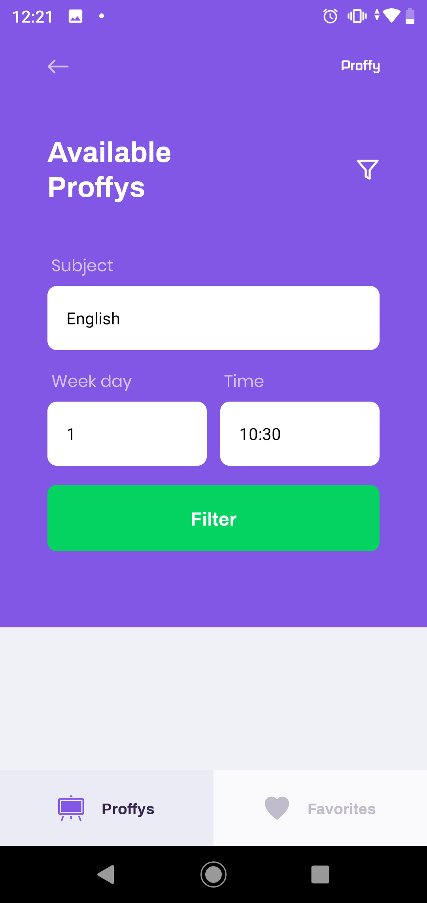

<link href="readmeStyle.css" rel="stylesheet" >
</link>

# Proffy Mobile Version

## Project Idea
This application was developed following the instructions of [Rocketseat](https://github.com/Rocketseat "Rocketseat github page"), during the Next Level Week #2 event. The idea was born as a __tribute to all educators__.

---

## Introduction
This is the mobile version of the [Proffy platform](https://github.com/phyJa/proffyWebPage "Web version repository") and my first React Native project! Feel free to use it and contribute! Please note that this is only the "front-end" of the application (I'm still studying how to unite with the server-side project and push them all here in GitHub). **The goal of this project is to connect teachers and students**. Take a look at its landing page:

> Landing page

    

---

## How does it work?
### If the user is a student
1. The user touches the study button. He/she will be redirected to this page:

    

2. Touch the filter icon and the following form will be displayed:

    

3. Type your data and touch "Filter". Note that the week day must be typed as numbers, from 0 (Sunday) to 6 (Saturday). This will be fixed soon! An example, searching for

    

we get:

    

4. Touch "Contact" and your WhatsApp app will open searching for the teacher number! Cool!

### If the user is a teacher
1. Touch the teach button
2. You will be told to access the proffy web page to submit your classes.

## Future Updates

## Deploy and beyond!